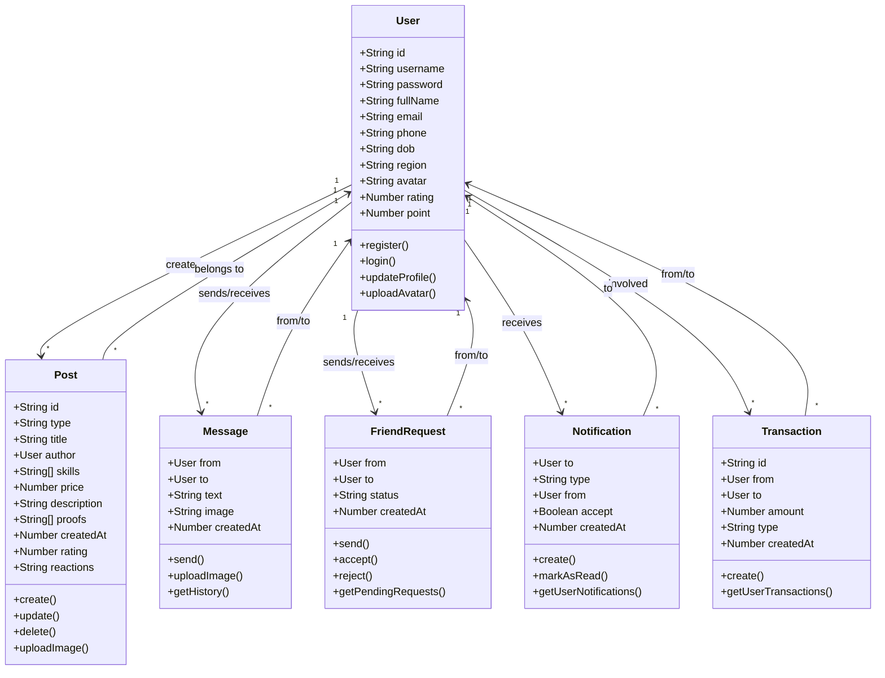

# Mô hình OOP cho Hệ thống Skills Trade Backend

## 1. **User** (Người dùng)

```markdown
### Thuộc tính:

- `id` (string) - Định danh duy nhất
- `username` (string) - Tên đăng nhập
- `password` (string) - Mật khẩu (chỉ dùng nội bộ)
- `fullName` (string) - Họ tên đầy đủ
- `email` (string) - Địa chỉ email
- `phone` (string) - Số điện thoại
- `dob` (string) - Ngày sinh (YYYY-MM-DD)
- `region` (string) - Khu vực sinh sống
- `avatar` (string) - URL ảnh đại diện
- `rating` (number) - Điểm đánh giá
- `point` (number) - Điểm tích lũy
- `posts` (Post[]) - Danh sách bài đăng
- `transactions` (Transaction[]) - Lịch sử giao dịch
- `notifications` (Notification[]) - Danh sách thông báo
- `bio` (string) - Note gì đó trên profile

### Phương thức:

- `register()` - Đăng ký tài khoản
- `login()` - Đăng nhập
- `updateProfile()` - Cập nhật thông tin
- `uploadAvatar()` - Tải ảnh đại diện
```

## 2. **Post** (Bài đăng)

```markdown
### Thuộc tính:

- `id` (string) - Mã bài đăng
- `type` (string) - Loại bài đăng ("OFFER" | "HIRE")
- `title` (string) - Tiêu đề bài đăng
- `author` (User) - Người đăng bài
- `skills` (string[]) - Danh sách kỹ năng
- `price` (number) - Giá tiền
- `description` (string) - Mô tả chi tiết
- `proofs` (string[]) - Danh sách file chứng minh
- `createdAt` (timestamp) - Thời gian tạo
- `rating` (number) - Điểm đánh giá
- `reactions` (string) - Phản ứng của người dùng

### Phương thức:

- `create()` - Tạo bài đăng mới
- `update()` - Cập nhật bài đăng
- `delete()` - Xóa bài đăng
- `uploadImage()` - Tải ảnh cho bài đăng
```

## 3. **Message** (Tin nhắn)

```markdown
### Thuộc tính:

- `from` (User) - Người gửi
- `to` (User) - Người nhận
- `text` (string) - Nội dung tin nhắn
- `image` (string) - URL ảnh (tùy chọn)
- `createdAt` (timestamp) - Thời gian gửi

### Phương thức:

- `send()` - Gửi tin nhắn
- `uploadImage()` - Tải ảnh chat
- `getHistory()` - Lấy lịch sử chat
```

## 4. **Partner requests** (Yêu cầu kết bạn)

```markdown
### Thuộc tính:

- `from` (User) - Người gửi lời mời
- `to` (User) - Người nhận lời mời
- `status` (string) - Trạng thái ("pending" | "accepted" | "rejected")
- `createdAt` (timestamp) - Thời gian gửi
- `postId` (String) - Id của bài post

### Phương thức:

- `send()` - Gửi yêu cầu kết bạn
- `accept()` - Chấp nhận yêu cầu
- `reject()` - Từ chối yêu cầu
- `getPendingRequests()` - Lấy danh sách yêu cầu chờ

### Luồng:

- User A make post & user B apply
- User B => Create partner request /partner-request (From user B, to user A, status Peding)
- Notification user B
    - Accept => Success => UserA.currentJob = postId, UserB.currentJob = postId
    - Reject => Failed => Delete request
```

## 5. **Notification** (Thông báo)

```markdown
### Thuộc tính:

- `to` (User) - Người nhận thông báo
- `type` (string) - Loại thông báo
- `from` (User) - Người gửi thông báo
- `accept` (boolean) - Trạng thái chấp nhận (nếu có)
- `createdAt` (timestamp) - Thời gian tạo

### Phương thức:

- `create()` - Tạo thông báo mới
- `markAsRead()` - Đánh dấu đã đọc
- `getUserNotifications()` - Lấy thông báo của user
```

## 6. **Transaction** (Giao dịch)

```markdown
### Thuộc tính:

- `id` (string) - Mã giao dịch
- `from` (User) - Người gửi
- `to` (User) - Người nhận
- `amount` (number) - Số tiền
- `type` (string) - Loại giao dịch
- `createdAt` (timestamp) - Thời gian thực hiện

### Phương thức:

- `create()` - Tạo giao dịch mới
- `getUserTransactions()` - Lấy lịch sử giao dịch
```

## Quan hệ giữa các đối tượng

### 1. **User - Post**

- **Quan hệ:** 1-nhiều
- **Mô tả:** Một User có thể tạo nhiều Post
- **Code:** `User.hasMany(Post)`, `Post.belongsTo(User)`

### 2. **User - Message**

- **Quan hệ:** Nhiều-nhiều
- **Mô tả:** User có thể gửi/nhận nhiều Message với nhiều User khác
- **Code:** `User.hasMany(Message, {as: 'sentMessages'})`, `User.hasMany(Message, {as: 'receivedMessages'})`

### 3. **User - FriendRequest**

- **Quan hệ:** Nhiều-nhiều
- **Mô tả:** User có thể gửi/nhận nhiều FriendRequest
- **Code:** `User.hasMany(FriendRequest, {as: 'sentRequests'})`, `User.hasMany(FriendRequest, {as: 'receivedRequests'})`

### 4. **User - Notification**

- **Quan hệ:** 1-nhiều
- **Mô tả:** Một User có thể nhận nhiều Notification
- **Code:** `User.hasMany(Notification)`, `Notification.belongsTo(User)`

### 5. **User - Transaction**

- **Quan hệ:** Nhiều-nhiều
- **Mô tả:** User có thể tham gia nhiều Transaction
- **Code:** `User.hasMany(Transaction, {as: 'sentTransactions'})`, `User.hasMany(Transaction, {as: 'receivedTransactions'})`

## Sơ đồ UML



## Các Service Layer

### 1. **UserService**

- Quản lý đăng ký/đăng nhập
- Quản lý profile
- Upload avatar
- Quản lý friend requests

### 2. **PostService**

- CRUD operations cho Post
- Upload post images
- Tìm kiếm và lọc bài đăng

### 3. **ChatService**

- Gửi/nhận tin nhắn
- Upload chat images
- Lấy lịch sử chat
- Real-time messaging (Socket.IO)

### 4. **NotificationService**

- Tạo thông báo
- Quản lý trạng thái đọc
- Push notifications

### 5. **GatewayService**

- API Gateway
- Load balancing
- Authentication/Authorization
- Request routing

## Database Schema (JSON Files)

### users.json

```json
{
    "username": "string",
    "password": "string",
    "email": "string",
    "phone": "string",
    "dob": "string",
    "fullName": "string",
    "region": "string"
}
```

### posts.json

```json
{
    "id": "string",
    "type": "string",
    "title": "string",
    "author": { "username": "string" },
    "skills": ["string"],
    "price": "number",
    "description": "string",
    "proofs": ["string"],
    "createdAt": "number",
    "rating": "number",
    "reactions": "string"
}
```

### messages.json

```json
{
    "from": "string",
    "to": "string",
    "text": "string",
    "image": "string",
    "createdAt": "number"
}
```

### friend_requests.json

```json
{
    "from": "string",
    "to": "string",
    "status": "string",
    "createdAt": "number"
}
```

### notifications.json

```json
{
    "to": "string",
    "type": "string",
    "from": "string",
    "accept": "boolean",
    "createdAt": "number"
}
```

## Microservices Architecture

```
┌─────────────┐    ┌─────────────┐    ┌─────────────┐    ┌─────────────┐
│   Gateway   │    │ UserService │    │PostService  │    │ChatService  │
│   (4000)    │◄──►│   (4001)    │    │   (4002)    │    │   (4003)    │
└─────────────┘    └─────────────┘    └─────────────┘    └─────────────┘
       │                   │                   │                   │
       └───────────────────┼───────────────────┼───────────────────┘
                           │                   │
                    ┌─────────────┐    ┌─────────────┐
                    │Notification │    │   Docker    │
                    │  Service    │    │  Compose    │
                    │   (4004)    │    │             │
                    └─────────────┘    └─────────────┘
```

## API Endpoints Summary

### User Management

- `POST /register` - Đăng ký
- `POST /login` - Đăng nhập
- `GET /get-profile` - Lấy profile
- `POST /update-profile` - Cập nhật profile
- `POST /upload-avatar` - Upload avatar

### Friend Management

- `POST /friend-request` - Gửi yêu cầu kết bạn
- `GET /friend-requests` - Lấy danh sách yêu cầu
- `POST /friend-request/respond` - Phản hồi yêu cầu
- `GET /friends` - Lấy danh sách bạn bè
- `POST /remove-friend` - Xóa bạn bè

### Chat

- `POST /messages` - Gửi tin nhắn
- `GET /messages` - Lấy lịch sử chat
- `POST /upload-chat-image` - Upload ảnh chat

### Posts

- `POST /posts` - Tạo bài đăng
- `GET /posts` - Lấy danh sách bài đăng
- `DELETE /posts/:id` - Xóa bài đăng
- `POST /upload-post-image` - Upload ảnh bài đăng

### Notifications

- `GET /notifications` - Lấy thông báo

## Design Patterns

### 1. **Repository Pattern**

- Tách biệt logic business và data access
- Dễ dàng thay đổi data source

### 2. **Service Layer Pattern**

- Tách biệt business logic
- Reusable services

### 3. **Factory Pattern**

- Tạo objects (User, Post, Message)
- Validation và initialization

### 4. **Observer Pattern**

- Real-time notifications
- Event-driven architecture

### 5. **Singleton Pattern**

- Database connections
- Configuration management

## Security Considerations

### 1. **Authentication**

- JWT tokens
- Session management
- Password hashing

### 2. **Authorization**

- Role-based access control
- Resource ownership validation

### 3. **Input Validation**

- Sanitize user inputs
- File upload validation
- SQL injection prevention

### 4. **Data Protection**

- Encrypt sensitive data
- Secure file storage
- HTTPS enforcement

## Performance Optimization

### 1. **Caching**

- Redis for session storage
- File caching for images
- API response caching

### 2. **Database Optimization**

- Indexing on frequently queried fields
- Connection pooling
- Query optimization

### 3. **File Handling**

- Image compression
- CDN for static files
- Lazy loading

### 4. **Load Balancing**

- Horizontal scaling
- Health checks
- Auto-scaling

## Testing Strategy

### 1. **Unit Tests**

- Service layer testing
- Model validation testing
- Utility function testing

### 2. **Integration Tests**

- API endpoint testing
- Database integration testing
- Microservice communication testing

### 3. **End-to-End Tests**

- User workflow testing
- Cross-browser testing
- Performance testing

### 4. **Security Testing**

- Penetration testing
- Vulnerability scanning
- Authentication testing

## Deployment Architecture

### Docker Compose Services

```yaml
services:
    user-service:
        build: ./microservices/user-service
        ports:
            - '4001:4001'
        volumes:
            - ./microservices/user-service/data:/app/data
            - ./microservices/user-service/avatars:/app/avatars

    post-service:
        build: ./microservices/post-service
        ports:
            - '4002:4002'
        volumes:
            - ./microservices/post-service/data:/app/data
            - ./microservices/post-service/post_images:/app/post_images

    chat-service:
        build: ./microservices/chat-service
        ports:
            - '4003:4003'
        volumes:
            - ./microservices/chat-service/data:/app/data
            - ./microservices/chat-service/chat_images:/app/chat_images

    notification-service:
        build: ./microservices/notification-service
        ports:
            - '4004:4004'
        volumes:
            - ./microservices/notification-service/data:/app/data

    gateway:
        build: ./microservices/gateway
        ports:
            - '4000:4000'
        depends_on:
            - user-service
            - post-service
            - chat-service
            - notification-service
```

## Technology Stack

### Backend

- **Runtime:** Node.js
- **Framework:** Express.js
- **Real-time:** Socket.IO
- **File Upload:** Multer
- **Image Processing:** Sharp
- **Google Sheets API:** googleapis

### Infrastructure

- **Containerization:** Docker
- **Orchestration:** Docker Compose
- **Data Storage:** JSON files + Google Sheets
- **File Storage:** Local file system

### Development Tools

- **Package Manager:** npm
- **Module System:** ES6 Modules
- **Code Quality:** ESLint, Prettier
- **Version Control:** Git

## Future Enhancements

### 1. **Database Migration**

- PostgreSQL/MongoDB integration
- Data migration from JSON files
- Backup and recovery strategies

### 2. **Advanced Features**

- Payment integration
- Rating and review system
- Advanced search and filtering
- Real-time notifications

### 3. **Scalability**

- Kubernetes deployment
- Auto-scaling policies
- Load balancer configuration
- CDN integration

### 4. **Monitoring & Analytics**

- Application performance monitoring
- User behavior analytics
- Error tracking and logging
- Health check endpoints

## Conclusion

Hệ thống Skills Trade Backend được thiết kế theo kiến trúc microservices với các đối tượng OOP rõ ràng, tách biệt các chức năng thành các service độc lập. Việc sử dụng Docker Compose giúp dễ dàng triển khai và quản lý các service. Kiến trúc này cho phép mở rộng và bảo trì dễ dàng trong tương lai.
